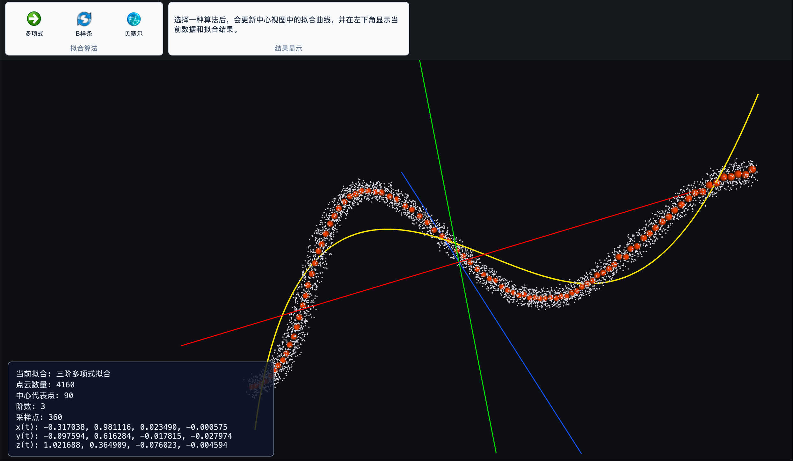
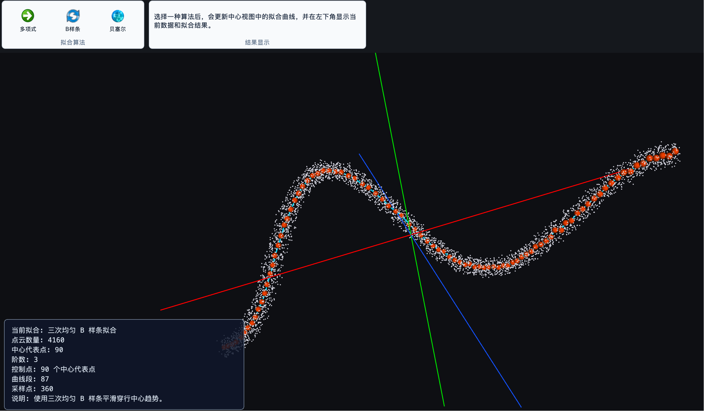
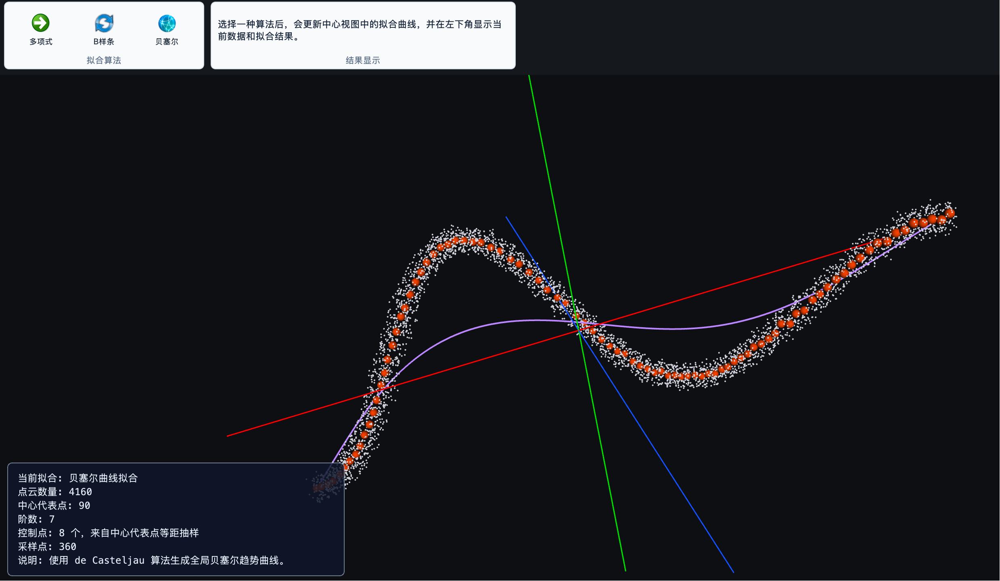

# 3DCurveFit

这是一个完整的 C++ + OpenSceneGraph(OSG) 教学示例项目，用来演示：

1. 在程序中自动生成一条“粗线/绳子状”的三维点云扫描数据；
2. 将点云写入 `point_cloud.txt`；
3. 再从 `point_cloud.txt` 读取三维点云；
4. 用 PCA 主方向投影得到参数 `t`，分段提取中心代表点；
5. 通过按钮触发三维参数曲线拟合，包括多项式、B 样条和贝塞尔曲线；
6. 使用 Qt Ribbon 风格主窗口嵌入 OSG 三维视图，可视化原始点云、中心代表点、拟合曲线和坐标轴。

## 项目结构

```txt
PolynomialCurveFitOSG/
├── CMakeLists.txt
├── main.cpp
├── images/
│   ├── 1.png
│   ├── 2.png
│   └── 3.png
├── include/
│   ├── core/
│   │   ├── GeometryTypes.h
│   │   └── PointCloudPipeline.h
│   ├── fitting/
│   │   ├── CurveFitResult.h
│   │   ├── PolynomialCurveFitter.h
│   │   ├── BSplineCurveFitter.h
│   │   └── BezierCurveFitter.h
│   ├── visualization/
│   │   └── OsgScene.h
│   └── ui/
│       ├── OsgWidget.h
│       └── MainWindow.h
├── src/
│   ├── core/
│   │   ├── GeometryTypes.cpp
│   │   └── PointCloudPipeline.cpp
│   ├── fitting/
│   │   ├── PolynomialCurveFitter.cpp
│   │   ├── BSplineCurveFitter.cpp
│   │   └── BezierCurveFitter.cpp
│   ├── visualization/
│   │   └── OsgScene.cpp
│   └── ui/
│       ├── OsgWidget.cpp
│       └── MainWindow.cpp
└── README.md
```

## 代码模块

- `core/GeometryTypes`：三维点、PCA 结果、中心代表点以及基础向量运算；
- `core/PointCloudPipeline`：模拟点云生成、文件读写、PCA 和分段中心点提取；
- `fitting/PolynomialCurveFitter`：正规方程、高斯消元和三维参数多项式拟合；
- `fitting/BSplineCurveFitter`：三次均匀 B 样条拟合；
- `fitting/BezierCurveFitter`：控制点抽取和 de Casteljau 贝塞尔拟合；
- `visualization/OsgScene`：OSG 点云、中心点、曲线、坐标轴和场景图层；
- `ui/OsgWidget`：Qt OpenGL 上下文与 OSG Viewer 的嵌入和输入事件转发；
- `ui/MainWindow`：Ribbon 界面、拟合按钮、图层控制和结果面板；
- `main.cpp`：应用初始化和各模块组装。

算法模块只依赖 C++ 标准库，不依赖 Qt 或 OSG。Qt 界面通过统一的
`CurveFitResult` 接收算法结果，再交给 OSG 场景模块显示。

## 编译方法

进入项目目录：

```bash
cd PolynomialCurveFitOSG
mkdir -p build
cd build
cmake ..
cmake --build .
```

项目会优先查找 Qt6：

```cmake
find_package(Qt6 QUIET COMPONENTS Widgets OpenGLWidgets)
```

如果没有 Qt6，会回退到 Qt5 Widgets。macOS + Homebrew Qt6 下，CMake 已对旧 `AGL` framework 链接项做兼容清理。

如果使用的是 Visual Studio、Xcode 或 Ninja，也可以指定生成器，例如：

```bash
cmake -G Ninja ..
cmake --build .
```

## 运行方法

在 `build` 目录中运行：

```bash
./PolynomialCurveFitOSG
```

Windows 下可执行文件通常位于类似位置：

```bat
.\Debug\PolynomialCurveFitOSG.exe
```

程序启动后会打开 Qt 主窗口，顶部是 ribbon 风格功能区，中间是嵌入式 OSG 三维视图，左下角叠加显示当前数据和拟合结果，底部状态栏显示简短运行状态。

三维视图支持：

- 鼠标左键旋转；
- 鼠标滚轮缩放；
- 鼠标中键或右键拖动平移，具体行为由 `osgGA::TrackballManipulator` 决定；
- ribbon 中的“复位”按钮恢复初始视角；
- ribbon 中的“全屏”按钮切换 Qt 主窗口全屏；
- ribbon 中的“截图”按钮保存当前 OSG 视图为 `osg_qt_screenshot_yyyyMMdd_HHmmss.png`。
- ribbon 的“拟合”页包含“多项式”“B样条”“贝塞尔”三个按钮，点击后更新同一个拟合曲线图层。

## point_cloud.txt

程序每次运行都会在当前工作目录生成 `point_cloud.txt`。文件格式为纯文本，每行一个三维点：

```txt
x y z
x y z
x y z
...
```

示例程序内部先生成弯曲中心线：

```cpp
x = t;
y = 2.0 * sin(0.8 * t);
z = 0.3 * t + 1.5 * cos(0.5 * t);
```

然后在中心线附近的法平面内加入随机半径扰动、切向扰动和测量噪声，形成类似扫描得到的粗线点云。默认生成 `520 * 8 = 4160` 个点。

## 拟合流程

程序没有使用 `z = f(x, y)` 这种曲面函数形式，而是使用三维参数曲线：

```txt
x(t) = a0 + a1*t + a2*t^2 + a3*t^3
y(t) = b0 + b1*t + b2*t^2 + b3*t^3
z(t) = c0 + c1*t + c2*t^2 + c3*t^3
```

公共预处理步骤：

1. 读取点云 `P_i = (x_i, y_i, z_i)`；
2. 计算点云均值和 3x3 协方差矩阵；
3. 通过幂迭代估计 PCA 主方向；
4. 将每个点投影到主方向上，得到参数 `t_i`；
5. 按 `t_i` 排序并分成 90 段；
6. 每段取均值点作为中心代表点。

“拟合”页提供三种按钮：

- 多项式：分别对 `x(t)`、`y(t)`、`z(t)` 做三阶多项式最小二乘拟合；
- B样条：使用中心代表点作为控制点，采样三次均匀 B 样条曲线；
- 贝塞尔：从中心代表点中等距抽取 8 个控制点，用 de Casteljau 算法采样全局贝塞尔趋势曲线。

每次点击拟合按钮都会替换当前拟合曲线，并在左下角面板显示数据量、算法名称、采样点数量和对应的系数或控制点说明。

## 中心代表点与控制点策略

画面中的橙色小球是分段提取的中心代表点，不一定等同于某种拟合算法最终使用的控制点。

中心代表点的提取过程如下：

1. 将所有原始点投影到 PCA 主方向，得到一维参数 `t`；
2. 按照 `t` 从小到大排列点云；
3. 将完整的 `t` 范围均匀分成 90 段；
4. 对每一段内的三维点求均值；
5. 将均值点作为这一段的中心代表点。

这一步可以显著减少原始扫描噪声，并把 4160 个原始点压缩为约 90 个有序中心趋势点。三种拟合算法对这些中心点采用不同的使用策略。

### 多项式拟合策略

多项式拟合把全部中心代表点作为最小二乘样本，而不是传统几何曲线中的控制点。

程序分别求解：

```txt
x(t) = a0 + a1*t + a2*t^2 + a3*t^3
y(t) = b0 + b1*t + b2*t^2 + b3*t^3
z(t) = c0 + c1*t + c2*t^2 + c3*t^3
```

当前实现使用三阶多项式，通过正规方程和高斯消元计算系数。



*图：三阶多项式对全部中心代表点进行全局趋势拟合。黄色曲线表达整体趋势，但不会逐点经过中心代表点。*

优点：

- 实现简单，系数含义明确；
- 使用全部中心代表点进行全局最小二乘拟合；
- 能有效描述整体延伸趋势；
- 对局部噪声不太敏感。

局限：

- 属于全局拟合，修改一个样本可能影响整条曲线；
- 三阶多项式表达能力有限，难以描述复杂或多次转弯的曲线；
- 高阶多项式可能出现数值不稳定或端部振荡；
- 曲线通常不会逐点经过中心代表点。

适合整体趋势比较简单、弯曲次数较少的点云中心线。

### 三次均匀 B 样条策略

当前实现把全部中心代表点直接作为三次均匀 B 样条控制点。每一段曲线由连续 4 个控制点共同决定：

```txt
P0, P1, P2, P3 -> 第 1 段
P1, P2, P3, P4 -> 第 2 段
P2, P3, P4, P5 -> 第 3 段
...
```

这种设计能够让曲线在保持平滑的同时较好地逼近中心趋势点，但 B 样条控制点主要用于拉动曲线，曲线通常不会逐点穿过控制点。



*图：三次均匀 B 样条使用全部中心代表点作为控制点。青色曲线具有局部控制和较好的平滑贴合能力。*

优点：

- 局部控制性好，单个控制点主要影响附近的曲线段；
- 段与段之间通常具有 `C²` 连续性，位置、切线和曲率都较平滑；
- 不强制穿过每个中心点，可以过滤一部分局部噪声；
- 中心点较密时，曲线能够较好地跟随点云中心趋势；
- 相比全局多项式，更适合具有多个局部弯曲的长曲线。

局限：

- 当前实现不是最小二乘 B 样条，没有求解全局最优控制点；
- 全部中心代表点都作为控制点，控制点过密时可能跟随局部噪声；
- 使用均匀参数，而不是弦长参数，点间距差异较大时效果会受影响；
- 当前形式不是夹持 B 样条，首尾曲线不会准确经过第一个和最后一个控制点；
- 曲线是逼近控制点，而不是插值控制点。

当前方案适合教学演示和点云中心趋势平滑。若需要更严格、更可控的拟合效果，可以进一步升级为：

1. 使用弦长参数化；
2. 使用夹持节点向量，使曲线通过首尾点；
3. 减少控制点数量；
4. 使用最小二乘方法求解 B 样条控制点；
5. 增加平滑正则项，在贴合程度与平滑程度之间进行调节。

### 贝塞尔拟合策略

直接用约 90 个中心代表点构造高阶贝塞尔曲线容易产生数值不稳定，而且所有控制点都会影响整条曲线。因此当前实现最多选择 8 个控制点。

选取方式：

1. 保留中心代表点的 PCA 参数顺序；
2. 在中心点索引范围内进行等距抽样；
3. 保留第一个和最后一个中心点；
4. 最多得到 8 个贝塞尔控制点；
5. 使用 de Casteljau 算法计算曲线上的采样点。

例如存在 90 个中心代表点时，程序会在从第 0 个到第 89 个的索引范围内近似等距选择 8 个点。



*图：贝塞尔拟合从中心代表点中等距抽取 8 个控制点。紫色曲线表达通过首尾位置的全局平滑趋势。*

优点：

- de Casteljau 算法稳定、实现清晰；
- 曲线一定经过第一个和最后一个控制点；
- 控制点较少，能生成非常平滑的全局趋势曲线；
- 适合表达单段、整体连续的绳索或轨迹形状。

局限：

- 属于全局控制，移动任意控制点都会影响整条曲线；
- 当前按中心点索引等距抽样，不是按照三维弧长等距抽样；
- 只取 8 个控制点时，可能忽略细小的局部弯曲；
- 控制点增加后，曲线阶数也会提高，编辑和数值稳定性会变差；
- 当前策略是趋势逼近，不是针对全部中心点的最小二乘贝塞尔拟合。

适合需要一条结构简单、整体平滑并通过首尾位置的全局趋势曲线。

### 三种方法对比

| 方法 | 中心点使用方式 | 局部控制 | 是否经过首尾点 | 主要特点 |
| --- | --- | --- | --- | --- |
| 三阶多项式 | 全部作为最小二乘样本 | 否 | 不保证 | 全局趋势简单、系数明确 |
| 三次均匀 B 样条 | 全部直接作为控制点 | 是 | 当前不保证 | 平滑性和局部贴合能力较好 |
| 贝塞尔 | 等距抽取最多 8 个控制点 | 否 | 是 | 全局平滑、结构简单 |

多项式最小二乘部分使用正规方程：

```txt
(A^T A)c = A^T y
```

线性方程组求解由 `src/fitting/PolynomialCurveFitter.cpp` 中的简单高斯消元实现，不依赖 Eigen、OpenCV 或 PCL。

## Qt + OSG 嵌入方式

当前版本不再使用独立的 OSG 全屏窗口，而是：

- 使用 `QMainWindow` 作为主窗口；
- 使用 `QTabWidget + QToolButton + QFrame` 搭建 ribbon 风格界面；
- 使用自定义 `OsgWidget : public QOpenGLWidget` 作为中心三维视图；
- 使用 `osgViewer::GraphicsWindowEmbedded` 将 OSG Viewer 嵌入 Qt OpenGL 上下文；
- 在 `paintGL()` 中调用 `viewer.frame()`；
- 在 `resizeGL()` 中同步 OSG viewport 和投影矩阵，保证 OSG 场景铺满 Qt 中央视图；
- 将 Qt 鼠标、滚轮、键盘事件转发到 OSG 的 `osgGA::EventQueue`。

## 可视化说明

OSG 嵌入视图中包含以下对象：

- 浅灰色小点：原始粗线点云；
- 橙色小球：分段提取出的中心代表点；
- 黄色连续线：三维多项式拟合曲线；
- 青色连续线：三次均匀 B 样条拟合曲线；
- 紫色连续线：贝塞尔拟合曲线；
- 红色轴线：X 轴；
- 绿色轴线：Y 轴；
- 蓝色轴线：Z 轴。

Viewer 使用：

- `osgViewer::Viewer`
- `osgGA::TrackballManipulator`
- `osgViewer::GraphicsWindowEmbedded`
- `QOpenGLWidget`

因此程序运行后可以用鼠标交互观察。

Ribbon 的“图层”页可以单独显示或隐藏点云、中心点、拟合曲线和坐标轴。

## 如果 CMake 找不到 OSG

本项目使用：

```cmake
find_package(OpenSceneGraph REQUIRED COMPONENTS osg osgDB osgGA osgViewer)
```

如果配置时报错找不到 OpenSceneGraph，可以检查：

1. OSG 是否已经正确安装；
2. OSG 的 CMake 配置文件或 Find 模块是否能被 CMake 找到；
3. 是否需要设置 `CMAKE_PREFIX_PATH`，例如：

   ```bash
   cmake -DCMAKE_PREFIX_PATH=/path/to/osg/install ..
   ```

4. 是否需要设置 `OpenSceneGraph_DIR`，指向包含 OpenSceneGraph CMake 配置文件的目录；
5. 是否需要设置 `OSG_DIR` 或 `OSG_ROOT`；
6. 运行时动态库路径是否正确，例如 macOS/Linux 下的 `DYLD_LIBRARY_PATH` 或 `LD_LIBRARY_PATH`，Windows 下的 `PATH`；
7. 如果运行时报 OSG 插件相关错误，可检查 `OSG_LIBRARY_PATH`。

Homebrew 安装的 OSG 通常可以尝试：

```bash
cmake -DCMAKE_PREFIX_PATH="$(brew --prefix)" ..
```

## 如果 CMake 找不到 Qt

如果配置时报错找不到 Qt，可以检查：

1. Qt6 或 Qt5 是否已经安装；
2. `CMAKE_PREFIX_PATH` 是否包含 Qt 安装路径；
3. Homebrew Qt 可以尝试：

   ```bash
   cmake -DCMAKE_PREFIX_PATH="$(brew --prefix qt);$(brew --prefix)" ..
   ```

4. 如果使用 Qt5：

   ```bash
   cmake -DCMAKE_PREFIX_PATH="$(brew --prefix qt@5);$(brew --prefix)" ..
   ```
